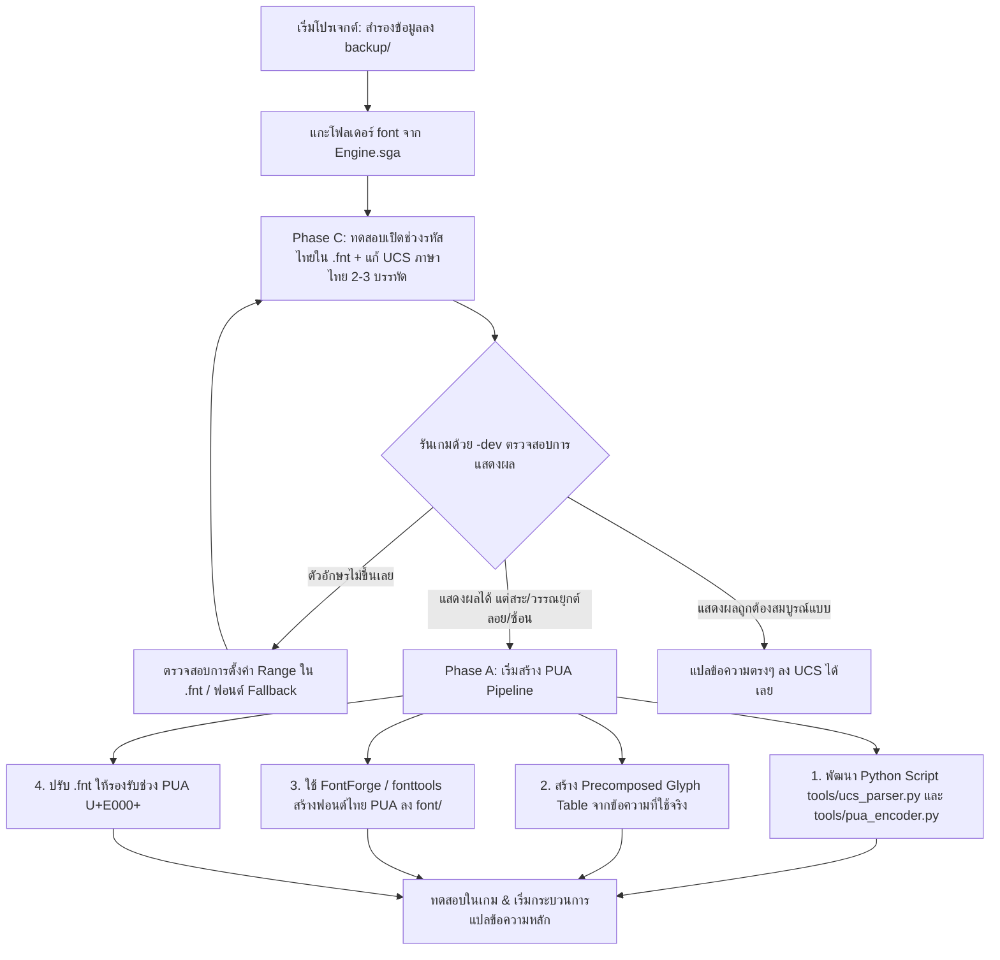

# รายงานการวิเคราะห์และข้อเสนอแนะเชิงเทคนิค: โปรเจกต์ COH1T
**โครงการ:** ม็อดแปลภาษาไทย Company of Heroes 1 (Legacy / Steam Relaunch)  
**เอกสารอ้างอิงหลัก:** [`README.md`](file:///C:/Users/MennzKTR/Desktop/COH1T/README.md)  
**วันที่จัดทำ:** 15 สิงหาคม 2026  

---

## 1. บทนำและวัตถุประสงค์ (Executive Summary)

เอกสารฉบับนี้สรุปผลการรีวิวและวิเคราะห์ความเป็นไปได้เชิงเทคนิคของโปรเจกต์ **COH1T** เพื่อพัฒนาม็อดแปลภาษาไทยสำหรับเกม *Company of Heroes (Relaunch - AppID 228200)* โดยเน้นการสร้าง Workflow ที่ทำงานได้จริง รวดเร็ว ไม่กระทบต่อความเสถียรของตัวเกม และสามารถดูแลรักษา/ต่อยอดได้ง่าย

---

## 2. การประเมินแผนงานปัจจุบัน (Plan Evaluation)

จากการประเมินโครงสร้างและแนวคิดใน [`README.md`](file:///C:/Users/MennzKTR/Desktop/COH1T/README.md):

### 2.1 จุดแข็ง (Strengths)
1. **ความเข้าใจโครงสร้างไฟล์ UCS ถูกต้อง:** ทราบเรื่องการเข้ารหัส `UTF-16LE` พร้อม Byte Order Mark (`FF FE`) และรูปแบบ `ID<TAB>Text` ซึ่งเป็นมาตรฐานของ Relic Engine
2. **ใช้ประโยชน์จากเครื่องมือทางการ (`Archive.exe`):** ไม่ต้องพึ่งพาซอฟต์แวร์บุคคลที่สามที่อาจสร้าง `.sga` header ผิดเวอร์ชัน
3. **การจัดโครงสร้าง Directory เป็นระบบ:** การแยก `backup/`, `work/`, `font/`, `tools/` ช่วยป้องกันปัญหาไฟล์เกมเสียหายและลดความสับสนในการทำงาน
4. **ลำดับการทดลองแบบ Fail-Fast (Phase C → Phase A):** ทดสอบสมมติฐานที่ง่ายและเร็วที่สุดก่อน (Phase C) เพื่อยืนยันพฤติกรรมของ Engine ก่อนลงแรงสร้าง PUA Pipeline (Phase A)

### 2.2 ข้อสังเกตและสมมติฐานที่ต้องระวัง (Key Considerations)
1. **Essence Engine 1.0 (เปิดตัวปี 2006) ไม่มีระบบ Complex Text Layout / Shaping:** เอนจินยุคนี้วาดตัวอักษรเรียงทีละ Glyph จากซ้ายไปขวาตามค่า Advance Width ส่งผลให้สระบน/ล่างและวรรณยุกต์ไทยจะซ้อนทับกันหรือลอยตำแหน่งผิด
2. **การทดสอบ Phase C จะทำหน้าที่เป็น "Sanity Check":** มีไว้เพื่อยืนยันว่า Engine ดึง Glyph จากช่วง Unicode ภาษาไทย (`U+0E00`–`U+0E7F`) ขึ้นมาแสดงบนจอได้หรือไม่เท่านั้น แต่สุดท้ายกว่า 99% ต้องใช้ระบบ **PUA (Phase A)** เพื่อให้แสดงผลถูกต้องสวยงาม

---

## 3. การวิเคราะห์สถาปัตยกรรม Relic Essence Engine 1.0

### 3.1 การโหลดไฟล์หลวม (Loose Files) และ Parameter `-dev`
ใน Relic Engine ไม่จำเป็นต้องแพ็กไฟล์กลับเป็น `.sga` ทุกครั้งที่ทดสอบ:
* **กลไก `-dev`:** เมื่อรันเกมด้วย Argument `-dev` ตัว Engine จะค้นหาไฟล์หลวมในโฟลเดอร์เกมก่อน (เช่น `Engine\font\...` หรือ `CoH\Locale\...`) ก่อนที่จะอ่านไฟล์จาก `.sga`
* **ประโยชน์:** สามารถแก้ไฟล์ `.fnt`, วาง `.ttf`, หรือแก้ `.ucs` ในโฟลเดอร์เกม แล้วเปิดเกมทดสอบได้ทันที ประหยัดเวลาในการ Repack ซ้ำๆ

### 3.2 ระบบฟอนต์ของเกม (`.fnt` และ Font Engine)
* ไฟล์ `.fnt` ใน CoH1 ทำหน้าที่กำหนด Font Face, Render Size, Antialiasing และ **Unicode Ranges** ที่เกมจะ Pre-render ลง Texture Atlas ตอนเริ่มเกม
* หากต้องการให้เกมอ่านภาษาไทย จะต้องระบุช่วงรหัสอักขระ (Range) เพิ่มใน `.fnt` เสมอ มิฉะนั้นตัวเกมจะไม่สร้าง Glyph บน Texture Atlas ส่งผลให้เกิดอาการ Missing Glyph (ตัวอักษรว่างเปล่าหรือเป็นเครื่องหมายสี่เหลี่ยม/คำถาม)

### 3.3 โครงสร้างไฟล์ข้อความ (`.ucs`)
* **Encoding:** `UTF-16 LE` with BOM
* **Data Format:** `[String_ID]\t[Localized_String]`
* **ข้อควรระวังในสตริง:** มี Escape Sequence, Variable placeholders (`%1`, `%1$s`), Format Tags (`$COLOR`, `[b]`, `[c:...]`) ซึ่งห้ามให้ Script แปลงข้อความไปแก้ไขหรือกระทบค่าเหล่านี้

---

## 4. แผนผังกระบวนการทำงาน (Implementation Roadmap)



---

## 5. รายละเอียดการดำเนินการแต่ละ Phase

### Phase C: การทดสอบเบื้องต้น (Validation Spike)
* **เป้าหมาย:** ยืนยันว่า Engine สามารถอ่าน Unicode ภาษาไทยและโหลดไฟล์จาก loose folder ได้
* **ขั้นตอน:**
  1. สกัด `font\` จาก `Engine.sga` โดยใช้คำสั่ง:
     ```powershell
     & "C:\Program Files (x86)\Steam\steamapps\common\Company of Heroes Relaunch\Archive.exe" -a "Engine.sga" -e "work\engine_extracted"
     ```
  2. เปิดอ่านไฟล์ `.fnt` เพื่อตรวจสอบโครงสร้าง Range ของ Glyph
  3. เพิ่มช่วง Unicode ภาษาไทย `0x0E00`–`0x0E7F` ลงใน `.fnt`
  4. แก้ไข `RelicCOH.English.ucs` ทดสอบใส่คำภาษาไทย เช่น `เมนูหลัก`, `เริ่มเกมใหม่`
  5. ทดสอบรันด้วย `RelicCOH.exe -dev`

### Phase A: การสร้างระบบ PUA (Precomposed Glyph Pipeline)
* **เป้าหมาย:** แก้ปัญหาสระลอย/วรรณยุกต์ทับกันโดยการแปลงคู่ผสมพยัญชนะ-สระ-วรรณยุกต์ให้เป็น 1 Glyph ในช่วง Private Use Area (`U+E000` ขึ้นไป)
* **โครงสร้างเครื่องมือใน [`tools/`](file:///C:/Users/MennzKTR/Desktop/COH1T/tools/):**
  1. `ucs_tool.py`:
     - แปลง `.ucs` (UTF-16LE) ↔ `.csv` / `.json` เพื่อให้ผู้แปลทำงานได้สะดวก
     - ตรวจสอบความถูกต้องของ ID และ Preserve Variable Tags
  2. `pua_encoder.py`:
     - วิเคราะห์ข้อความภาษาไทยที่แปลแล้ว ค้นหาคู่ผสมสระ-วรรณยุกต์ทั้งหมด
     - แมปคู่ผสมเหล่านั้นเป็นรหัส PUA (`0xE000`–`0xEFFF`)
     - เข้ารหัสข้อความไทยใน `.csv` / `.ucs` ให้กลายเป็นข้อความ PUA ก่อนนำเข้าเกม
  3. `font_builder.py`:
     - สคริปต์อัตโนมัติ (ใช้ `fonttools` หรือ `fontforge`) นำฟอนต์ต้นแบบ (เช่น Sarabun, Noto Sans Thai) มาสร้าง Precomposed Glyphs ตามตาราง PUA ที่วิเคราะห์ได้

---

## 6. สรุปคำสั่งสำคัญ (Cheat Sheet Reference)

```powershell
$GAME_DIR = "C:\Program Files (x86)\Steam\steamapps\common\Company of Heroes Relaunch"
$ARCHIVE  = "$GAME_DIR\Archive.exe"

# 1. ดูไฟล์ใน Archive
& $ARCHIVE -a "$GAME_DIR\Engine\Archives\Engine.sga" -l

# 2. แตกไฟล์ทั้งหมด
& $ARCHIVE -a "$GAME_DIR\Engine\Archives\Engine.sga" -e "C:\Users\MennzKTR\Desktop\COH1T\work\engine_extracted"

# 3. รันเกมพร้อมโหมด Loose Files (-dev)
& "$GAME_DIR\RelicCOH.exe" -dev
```

---

## 7. แผนปฏิบัติการขั้นถัดไป (Next Action Items)

- [ ] **Step 1:** สำรองไฟล์ `RelicCOH.English.ucs` และ `Engine.sga` ลงโฟลเดอร์ [`backup/`](file:///C:/Users/MennzKTR/Desktop/COH1T/backup/)
- [ ] **Step 2:** แตกไฟล์ `Engine.sga` เพื่อนำไฟล์ในโฟลเดอร์ `font/` ออกมาวิเคราะห์โครงสร้าง `.fnt`
- [ ] **Step 3:** สร้างสคริปต์ไพธอน `tools/ucs_tool.py` เพื่ออ่าน/เขียนไฟล์ UCS
- [ ] **Step 4:** ดำเนินการทดสอบ Phase C บนเกมจริง
